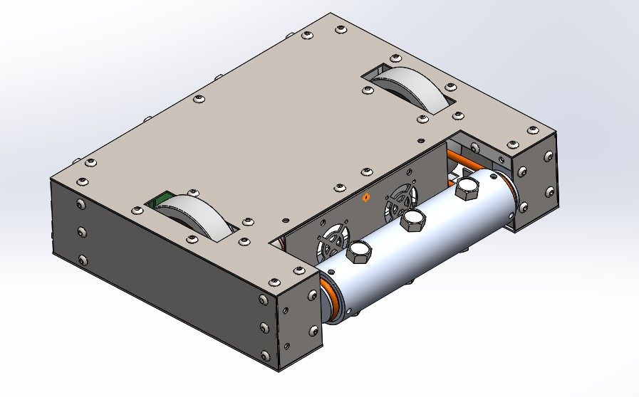

# Building a Battle Bot 
_A step-by-step guide to designing, building, and programming a battle bot from scratch._


#### By: Scott Barnes* & Chris Poole** 
The George Washington University  
School of Engineering & Applied Science   
_*Smart Systems Laboratory_  
_**Flight Dynamics Laboratory_


## Introduction:
We present a step-by-step process for creating your own remote-controlled battle bot from scratch, covering all hardware and software used in our design. While the goal of our project was to design a battle bot, the electrical design and software we used can applied to other robotic applications. We have done our best to provide comprehensive explanations of our source code and wiring diagrams, and have included a few unit tests to help you along the way.

We'll walk you through our entire design process. However, if you'd just like to skip to the fully functioning code for the deployed system, feel free to skip to the [end](#40-final-implementation-all-deployed-electronics--software). 

All source code can be found in the project's [GitHub Repository](https://github.com/scottbarnesg/battle_bot). 

## Project Overview:
Our system consists of two major components: the controller and the robot. The controller consists of the input device (a Logitech310 USB controller), a Raspberry Pi for processing the controller inputs, and an Arduino for transmitting the signals to the robot. The robot uses a single Arduino to receive signals from the controller, interpret the signals, and sent commands to the drive motor controller and the weapon (a spinning drum). 

## 1.0: Getting it Moving:
The obvious starting point for our robot is to get it to drive around. We use a simple WASD keyboard controller, which moves the robot for a pre-set amount of time in the direction corresponding to the key pressed. This is the best way to ensure your core electronics are working correctly before we add in the RF communication

### 1.1: Electronics:
Instructions, diagrams, and more coming soon!

### 1.2: Software:

#### Prototype Controller Code
First, we'll define our pins. These correspond to how your motors are wired to your speed controller arduino pins. 
```
#define ENA 8
#define ENB 12
#define L_forward 9
#define L_reverse 10
#define R_reverse 11
#define R_forward 6
```
Then, we create global variable for reading inputs from the computer
```
int inpt;
```
In the setup function, we set our pins to "output" and establish a serial connection with the computer (so that we can communicate with the robot).
```
void setup() {

  pinMode(ENA, OUTPUT);
  pinMode(ENB, OUTPUT);
  pinMode(L_forward, OUTPUT);
  pinMode(R_forward, OUTPUT);
  pinMode(L_reverse, OUTPUT);
  pinMode(R_reverse, OUTPUT);
  pinMode(13, OUTPUT);

  digitalWrite(ENA,HIGH);
  digitalWrite(ENB,HIGH);
  digitalWrite(13,LOW);

  Serial.begin(9600);
}
```
Now for the loop function. First, we check for a new input from the serial port and read those incoming values as an int, which converts the keyboard input to the corresponsing ASCII values. We then write to the pins corresponding to the input.
```
void loop() {
  if (Serial.available()) // Non-blocking
  {
    digitalWrite(13,HIGH);
    inpt = Serial.read();
    switch(inpt) // switch between WASD in ASCII
    {
      case 119: // w
        Serial.println("forward");
        digitalWrite(L_forward, HIGH);
        digitalWrite(R_forward, HIGH);
        delay(100);
        digitalWrite(L_forward,LOW);
        digitalWrite(R_forward, LOW);
        break;
      case 97: //a
        Serial.println("left");
        digitalWrite(L_reverse,HIGH);
        digitalWrite(R_forward,HIGH);
        delay(100);
        digitalWrite(L_reverse,LOW);
        digitalWrite(R_forward,LOW);
        break;
      case 115: //s
        Serial.println("reverse");
        digitalWrite(L_reverse,HIGH);
        digitalWrite(R_reverse,HIGH);
        delay(250);
        digitalWrite(L_reverse,LOW);
        digitalWrite(R_reverse,LOW);
        break;
      case 100: //d
        Serial.println("right");
        digitalWrite(L_forward,HIGH);
        digitalWrite(R_reverse,HIGH);
        delay(100);
        digitalWrite(L_forward,LOW);
        digitalWrite(R_reverse,LOW);
        break;
    }
  }
  digitalWrite(13,LOW);   
}
```


## 2.0: RF Communication Basics

### 2.1: Electronics

### 2.2: Software


#### 2.2.1: Transmitter

#### 2.2.2: Receiver

## 3.0: Putting it All Together

## 4.0: Final Implementation (All Deployed Electronics & Software)  
Finally! Here's everything we used in our final implementation (Coming Soon).

### 4.1: Electronics

### 4.2: Software


# Markdown Reference Material (Delete Later)

### Markdown

Markdown is a lightweight and easy-to-use syntax for styling your writing. It includes conventions for

```markdown
Syntax highlighted code block

# Header 1
## Header 2
### Header 3

- Bulleted
- List

1. Numbered
2. List

**Bold** and _Italic_ and `Code` text

[Link](url) and 
```

For more details see [GitHub Flavored Markdown](https://guides.github.com/features/mastering-markdown/).

### Jekyll Themes

Your Pages site will use the layout and styles from the Jekyll theme you have selected in your [repository settings](https://github.com/scottbarnesg/battle_bot/settings). The name of this theme is saved in the Jekyll `_config.yml` configuration file.

### Support or Contact

Having trouble with Pages? Check out our [documentation](https://help.github.com/categories/github-pages-basics/) or [contact support](https://github.com/contact) and we’ll help you sort it out.
